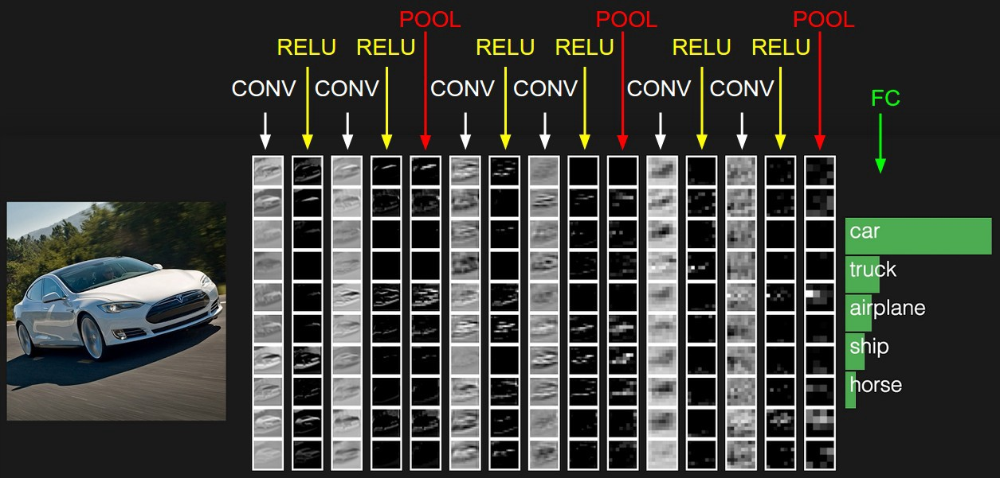
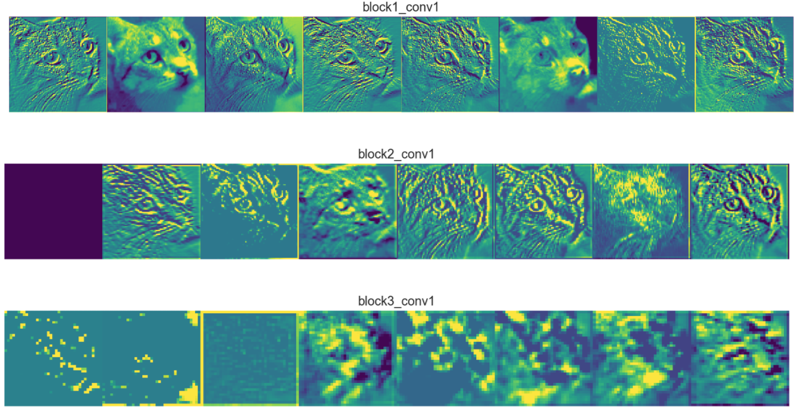

# Visualisation of Conv layers in a pruned VGG16 network

## Solution
The required task is in the Vis.ipynb

## Setup
1. Clone this repo.
2. Download the dataset from [here](https://www.kaggle.com/c/dogs-vs-cats).
3. Download the pruned model from [here](https://drive.google.com/file/d/1OAUZeUqozrA4Rh50MJ3hQUA-Q8XFV13r/view?usp=sharing)
4. Download the base model (not pruned) [here](https://drive.google.com/open?id=1iiwwflrNDzwFy3J-nqn-K0YDmp1D7_yV)

## Resources and References
1. Pruning : A silghtly modifed verison of the code for the following github repo was used to genrated the pruned model for the visualisation purpose. Repo : https://github.com/jacobgil/pytorch-pruning.git

2. Layer-Visualisation : The following article from stanford lecture cs231n http://cs231n.github.io/understanding-cnn/ and the javascript based tutorial by Andrej Karpathy https://cs.stanford.edu/people/karpathy/convnetjs/demo/mnist.html were used for the purpose of displaying the feature maps and weights of layers 1-5

3. Dataset : A subset of the following dataset was used during training the VGG16 model. https://www.kaggle.com/c/dogs-vs-cats

<b>NOTE</b> The images need to segregated into respective label folders to resemble a file structure like :

Train

......... dogs

......... cats

Test

......... dogs

......... cats

The goal of the project was to reproduce something similar to the diagrams below where at each <b>Conv layer</b> of the pruned VGG16 net we plot all of its feature maps and weights.

or a more closer example to our current dataset :

## Software and Frameworks
1. Python 3.6.5
2. PyTorch 1.0.1
3. Numpy
4. Matplotlib
5. OS : MacOS

## TBD
1. Train the base model on a larger dataset to obtain better accuracy.